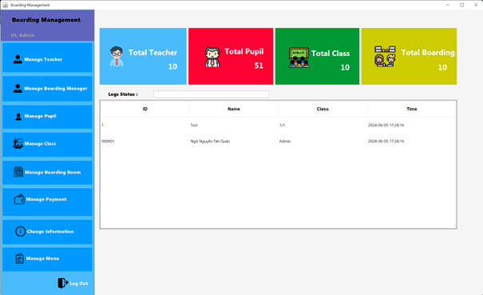

# Boarding Management System for Primary School

Welcome to the **Boarding Management System** project repository! This project is designed to manage the daily operations and activities of a primary school boarding system. The system helps in managing student information, dormitory assignments, attendance, and other essential activities.

## About
- **Project Name**: Boarding Management System for Primary School
- **Objective**: To develop a web-based system that simplifies the management of boarding activities for primary school students.
- **Technology Stack**: Java swing , MySQL , XAMPP and NetBeans for build and run.

## Table of Contents
- [Introduction](#introduction)
- [Features](#features)
- [Installation](#installation)
- [Usage](#usage)
- [Contributing](#contributing)
- [License](#license)

## Introduction
The Boarding Management System aims to facilitate the management of dormitory operations for primary school students. It includes functionalities such as student registration, dormitory assignments, attendance tracking, and activity reporting.

## Features
- **Student Management**: Add, update, and delete student records.
- **Dormitory Management**: Assign students to dormitories and manage room assignments.
- **Attendance Tracking**: Report and track student attendance for various dormitory activities.
- **Activity Management**: Manage and view activities and events related to dormitory life.
- **Admin Interface**: Access for administrators to manage all aspects of the system.
- **Teacher and Student Interfaces**: Interfaces for teachers and students to report absences and view related information.

## Installation
To set up the Boarding Management System locally, follow these steps:

1. **Clone the repository**:
    ```bash
    git clone https://github.com/your-username/boarding-management-system.git
    ```

2. **Navigate to the project folder**:
    ```bash
    cd boarding-management-system
    ```

3. **Install dependencies**:
    Install any required dependencies. This step may vary depending on the technologies used. For a typical Node.js setup:
    ```bash
    npm install
    ```

4. **Run the project**:
    Start the application. For example, if using Node.js:
    ```bash
    npm start
    ```

## Usage
1. **Admin Access**: Log in as an admin to manage students, dormitories, and activities.
2. **Teacher Access**: Log in as a teacher to report absences and view student information.
3. **Student Access**: Log in as a student to view your information and report absences.

Here are some screenshots of the Boarding Management System:


*Admin Dashboard*


*Student Management Page*


*Attendance Tracking*

## Contributing
Contributions are welcome! Feel free to open an issue or submit a pull request.

## License
This project is licensed under the MIT License. See the [LICENSE](LICENSE) file for details.

---

Thank you for exploring the Boarding Management System project! 🚀
